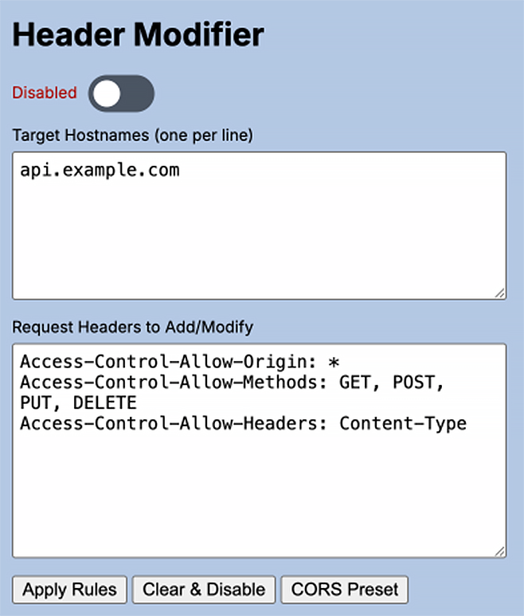

# Request Headers (including CORS) Modifier

## Description

The Request Headers (including CORS) Modifier is a Chrome extension designed to modify HTTP request headers, primarily for development purposes. It allows you to add or modify, enabling you to bypass CORS restrictions, test different configurations, and debug web applications more efficiently. In addition to using the extension from the Chrome Extensions bar, it also has its API exposed to the global window (via `window.corsHeaderModifier`), thus allowing use on demand and in an automated way, either from console or from sideloaded scripts such as Tampermonkey!

## Features

- **Request Header Modification:** Add or modify request headers.
- **CORS Bypass:** Easily bypass CORS restrictions by setting the necessary request headers.
- **Enable/Disable:** Toggle the extension on or off with a single click.
- **Enable/Disable via API:** Toggle the extension on or off by running API methods exposed to the global object (see `window.corsHeaderModifier` use in [How it Works](#how-it-works) section).
- **Persistent Settings:** Settings are saved and restored across browser sessions.
- **Simple UI:** Easy-to-use popup interface for managing hostnames and headers.

## Preview

## Installation

1.  Download the project files.
2.  Open Chrome and navigate to `chrome://extensions`.
3.  Enable "Developer mode" in the top right corner.
4.  Click "Load unpacked" and select the directory containing the extension files (where `manifest.json` is located).

## Usage

1.  Click the extension icon in the Chrome toolbar to open the popup.
2.  Enter the target hostnames (one per line) in the "Target Hostnames" field. These are the domains for which the headers will be modified.
3.  Enter the request headers you want to add or modify in the "Request Headers to Add/Modify" field. Use the format `Header-Name: Header-Value` for each header, with each header on a new line.
4.  Click "Apply Rules" to save and apply the header modifications.
5.  Click "Clear & Disable" to remove all settings and disable the extension.
6.  Use the toggle switch to quickly enable or disable the extension.
7.  Click "CORS Preset" to pre-fill the Request Headers with common CORS headers.

## How it Works

The extension uses Chrome's [declarativeNetRequest API](https://developer.chrome.com/docs/extensions/reference/declarativeNetRequest/) to modify headers. Here's a breakdown of the key components:

- **`manifest.json`:** Declares the extension's metadata, permissions, and content scripts.
- **`popup.html`:** The HTML structure for the extension's popup interface.
- **`popup.js`:** Handles user interactions in the popup, saves settings to Chrome storage, and communicates with the service worker.
- **`service-worker.js`:** (Background Script) Listens for events, manages the extension's state, and applies/removes header modification rules using the `declarativeNetRequest` API.
- **`content-script.js`:** Injected into web pages to expose an API to the page's main JavaScript context (`main.js`).
- **`main.js`:** Injected into the web page and exposes `window.corsHeaderModifier` to enable and disable the extension from the page. This allows you to run `window.corsHeaderModifier.enable()` and `window.corsHeaderModifier.disable()` from console and/or sideloaded scripts such as Tampermonkey to enable/disable the modified headers.

## Files

- `manifest.json`: Extension manifest file.
- `popup.html`: Popup HTML file.
- `popup.js`: Popup JavaScript file.
- `service-worker.js`: Service worker script.
- `content-script.js`: Content script to inject `main.js`.
- `main.js`: Script injected into the web page.
- `icons/`: Directory containing the extension icons.

## Permissions

The extension requires the following permissions:

- `declarativeNetRequest`: To modify HTTP headers.
- `storage`: To store settings.
- `activeTab`: To access the currently active tab.
- `scripting`: To inject scripts into web pages.
- `host_permissions`: `<all_urls>`: To modify headers for all URLs.

## Disclaimer

This extension is designed for development purposes only. Modifying headers can have unintended consequences, and it should not be used in a production environment.

## License

[MIT](LICENSE)
